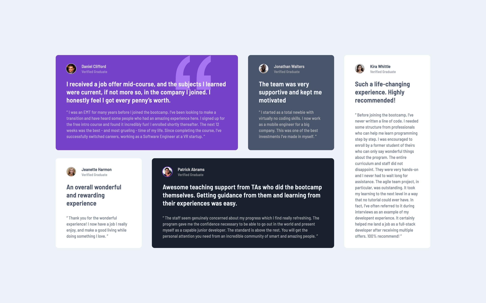

# Frontend Mentor - Testimonials grid section solution

This is a solution to the [Testimonials grid section challenge on Frontend Mentor](https://www.frontendmentor.io/challenges/testimonials-grid-section-Nnw6J7Un7). Frontend Mentor challenges help you improve your coding skills by building realistic projects. 

## Table of contents

- [Overview](#overview)
  - [The challenge](#the-challenge)
  - [Screenshot](#screenshot)
  - [Links](#links)
- [My process](#my-process)
  - [Built with](#built-with)
  - [What I learned](#what-i-learned)
  - [Continued development](#continued-development)
  - [Useful resources](#useful-resources)
- [Author](#author)
- [Acknowledgments](#acknowledgments)

## Overview

### The challenge

Users should be able to:

- View the optimal layout for the site depending on their device's screen size

### Screenshot



### Links

- Solution URL: [Github](https://github.com/coinfilip/frontend-mentor/tree/main/junior/testimonials-grid-section-main)
- Live Site URL: [Github Pages](https://coinfilip.github.io/frontend-mentor/junior/testimonials-grid-section-main)

## My process

### Built with

- Semantic HTML5 markup
- CSS custom properties
- Flexbox
- CSS Grid

### What I learned

One of the challenging problems I noticed as I start to style the HTML structure is the inconsistency of the rules for the child elements inside each of the containers. With that, expect a confusing amount of selectors in the stylesheet. But one thing I discovered thru this challenge is using the ```:not``` selector

```css
article.reviewItem > :not(.itemHead) {
    padding: 0 1.5px;
}
```

I used it to select all child elements inside ```.reviewItem``` container except the ```.itemHead``` part for the desktop design as the heading and the paragraph below it is slightly indented. 

```css
.itemHeadAvatar:not(.daniel .itemHeadAvatar, 
                    .patrick .itemHeadAvatar) {
    height: 29px;
    border-radius: 50%;
    margin: 1px;
}
```

Another example of using the ```:not``` selector is shown above where the definitions stated are for the ```.itemHeadAvatar``` elements that are not part of ```.daniel``` and ```.patrick``` containers.

### Continued development

Still ain't oriented on the full features and/or properties of Grid, as well as the CSS selectors. So would continue to learn more about the 2 topics mentioned.

### Useful resources

- [CSS Selector Reference](https://www.w3schools.com/cssref/css_selectors.php) - from W3Schools. Recommended if you want a quick look for a refresher on the selector you have in mind but can't remember the exact syntax.
- [CSS grid layout](https://developer.mozilla.org/en-US/docs/Web/CSS/CSS_grid_layout#reference) - from MDN. Handy if you want a gateway to CSS properties used with CSS Grid.

## Author

- Website - [Github Profile](https://github.com/coinfilip)
- Frontend Mentor - [@coinfilip](https://www.frontendmentor.io/profile/coinfilip)

## Acknowledgments

- The Odin Project
- those behind the sites cited in Useful resources section 
- Frontend Mentor for the opportunity to take on this challenge, and the people that I interacted with through this platform
