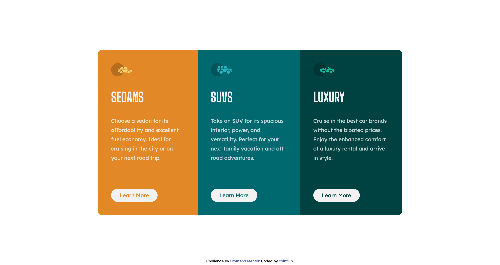

# Frontend Mentor - 3-column preview card component solution

This is a solution to the [3-column preview card component challenge on Frontend Mentor](https://www.frontendmentor.io/challenges/3column-preview-card-component-pH92eAR2-). Frontend Mentor challenges help you improve your coding skills by building realistic projects. 

## Table of contents

- [Overview](#overview)
  - [The challenge](#the-challenge)
  - [Screenshot](#screenshot)
  - [Links](#links)
- [My process](#my-process)
  - [Built with](#built-with)
  - [What I learned](#what-i-learned)
  - [Continued development](#continued-development)
  - [Useful resources](#useful-resources)
- [Author](#author)
- [Acknowledgments](#acknowledgments)

## Overview

### The challenge

Users should be able to:

- View the optimal layout depending on their device's screen size
- See hover states for interactive elements

### Screenshot



### Links

- Solution URL: [Github](https://github.com/coinfilip/frontend-mentor/tree/main/newbie/3-column-preview-card-component-main)
- Live Site URL: [Github Pages](https://coinfilip.github.io/frontend-mentor/newbie/3-column-preview-card-component-main/)

## My process

### Built with

- Semantic HTML5 markup
- CSS custom properties
- Flexbox

### What I learned

One issue I encountered is the overflow on body (making the first div inside main not display in full on mobile screen size) as I haven't properly set the height of the body to accommodate the whole height of the contents inside main. One remedy I discovered is by setting the min-height of body to 100vh instead of only height. 

For active state/s on the button, I used the :active selector
```css
button:active {
  ...
}
```

On the development of this solution, I adopted the mindset of dividing the challenge into smaller problems that I can solve. I don't know if it triggered some headaches to those reading the (commit) history, but I made a lot of commits every time each change was made. *I hope it didn't, but I understand if that's not the case.*

Also, I made a first attempt on developing the solution to the challenge on another branch (draft) instead of main. Commands like `git checkout -b draft` (creates a branch called *draft*), `git push origin draft` (pushes commits from local machine to remote repository) and `git branch -a` (just shows all branches). Once finished, made a pull request and merged the new branch back to main without review, gaining a YOLO achievement from Github in the process. *Lol*.

### Continued development

For CSS: Might focus in the future on honing my Flexbox skills and using Grid as well.

For Git/Github: Practice more on branching and making merge/pull request on future challenges.

### Useful resources

- [How to prevent overflow scrolling in CSS](https://blog.logrocket.com/how-to-prevent-overflow-scrolling-css/) - This helped me to pinpoint the possible source of the problem when I encountered the sedan div being cropped when screen size is below desktop.
- [Create a new branch with git and manage branches](https://github.com/Kunena/Kunena-Forum/wiki/Create-a-new-branch-with-git-and-manage-branches) - One of the helpful articles that got me starting to create a new branch to develop the solution to this challenge.

## Author

- Website - [Github  Profile](https://github.com/coinfilip)
- Frontend Mentor - [@coinfilip](https://www.frontendmentor.io/profile/coinfilip)

## Acknowledgments

Would like to thank:

- The Odin Project
- those behind the sites cited in Useful resources section
- Frontend Mentor for the opportunity to take on this challenge