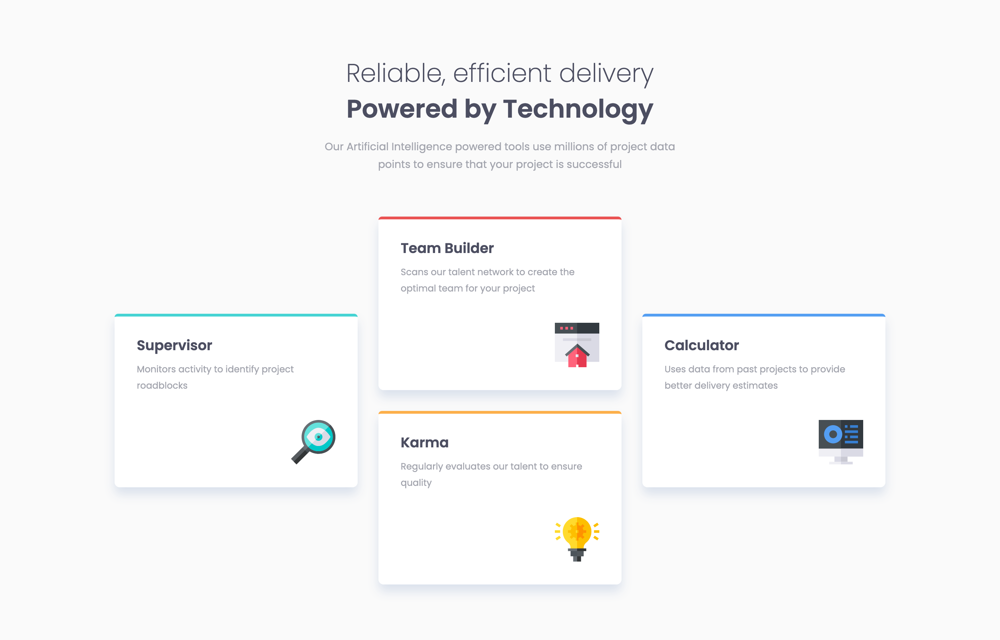

# Frontend Mentor - Four card feature section solution

This is a solution to the [Four card feature section challenge on Frontend Mentor](https://www.frontendmentor.io/challenges/four-card-feature-section-weK1eFYK). Frontend Mentor challenges help you improve your coding skills by building realistic projects. 

## Table of contents

- [Overview](#overview)
  - [The challenge](#the-challenge)
  - [Screenshot](#screenshot)
  - [Links](#links)
- [My process](#my-process)
  - [Built with](#built-with)
  - [What I learned](#what-i-learned)
  - [Continued development](#continued-development)
  - [Useful resources](#useful-resources)
- [Author](#author)
- [Acknowledgments](#acknowledgments)

## Overview

### The challenge

Users should be able to:

- View the optimal layout for the site depending on their device's screen size

### Screenshot



### Links

- Solution URL: [Github](https://github.com/coinfilip/frontend-mentor/tree/main/newbie/four-card-feature-section-master)
- Live Site URL: [Github Pages](https://coinfilip.github.io/frontend-mentor/newbie/four-card-feature-section-master/)

## My process

### Built with

- Semantic HTML5 markup
- CSS custom properties
- Flexbox
- CSS Grid

### What I learned

The main roadblock upon seeing the desktop design in utilizing Grid to arrange the four containers on a cross-like layout. After some Googling (see [Useful resources](#useful-resources) for the links), came up with these lines:

```css
justify-items: center;
grid-template: 
  ".   team     ."
  "sup team  calc"
  "sup karma calc"
  ".   karma    .";
```

Originally, I used the ```grid-template-columns``` and ```grid-template-rows``` properties to define the rows and columns of the grid but ```grid-template``` does the same so I ditched those first two in favor of the latter.

### Continued development

Getting used to Grid, although I still feel that I have a lot to learn on this CSS layout so will push myself (hopefully) to check it out further for more information.

Some of my head-scratching is spent on thinking what to type inside alt text attribute for the icons. Kind of frustrating since you want to be descriptive but also use as less words as possible. It will get better in time, but I would like to pat myself on the back for finishing that.

Also tried using 3 media queries (mobile, tablet/laptop, and laptop L/desktop) for this solution. Felt that I need to use the extra space on the sides when the width goes below the minimum for the desktop one. Still doesn't cover all bases as I noticed one flaw when the page is zoomed in (the margin on the top section), so I'm looking forward to more experience on dealing with more queries/device sizes.

### Useful resources

- [line-height | MDN reference](https://developer.mozilla.org/en-US/docs/Web/CSS/line-height#values) - As I realized that I utilize this property more frequently in the challenges I take, I took the initiative to know the default value which is 1.2 of the element's font-size based on its font-family value.
- [justify-items | CSSTricks reference](https://css-tricks.com/snippets/css/complete-guide-grid/#aa-justify-items) - I struggled to center items inside the grid unlike in flex so this became a handy link to check out if you are struggling with the same situation as mine.

## Author

- Website - [Github Profile](https://github.com/coinfilip)
- Frontend Mentor - [@coinfilip](https://www.frontendmentor.io/profile/coinfilip)

## Acknowledgments

- The Odin Project
- those behind the sites cited in Useful resources section 
- Frontend Mentor for the opportunity to take on this challenge
