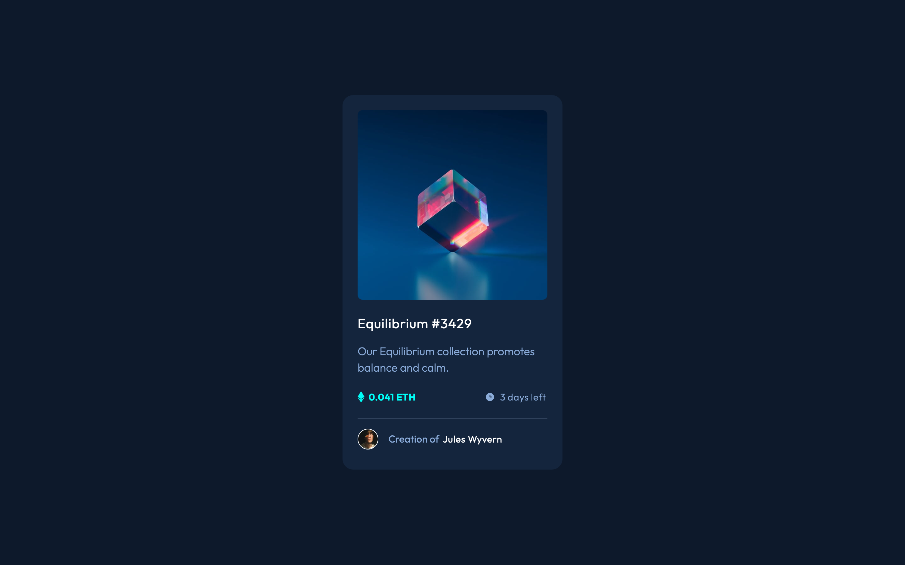

# Frontend Mentor - NFT preview card component solution

This is a solution to the [NFT preview card component challenge on Frontend Mentor](https://www.frontendmentor.io/challenges/nft-preview-card-component-SbdUL_w0U). Frontend Mentor challenges help you improve your coding skills by building realistic projects. 

## Table of contents

- [Overview](#overview)
  - [The challenge](#the-challenge)
  - [Screenshot](#screenshot)
  - [Links](#links)
- [My process](#my-process)
  - [Built with](#built-with)
  - [What I learned](#what-i-learned)
  - [Continued development](#continued-development)
  - [Useful resources](#useful-resources)
- [Author](#author)
- [Acknowledgments](#acknowledgments)

## Overview

### The challenge

Users should be able to:

- View the optimal layout depending on their device's screen size
- See hover states for interactive elements

### Screenshot



### Links

- Solution URL: [Github](https://github.com/coinfilip/frontend-mentor/tree/main/newbie/nft-preview-card-component-main)
- Live Site URL: [Github Pages](https://coinfilip.github.io/frontend-mentor/newbie/nft-preview-card-component-main/)

## My process

### Built with

- Semantic HTML5 markup
- CSS custom properties
- Flexbox

### What I learned

For this challenge, the main lesson I learned is the pseudo-element ```::after```. I used it for the hover state rules on the equilibrium image. 

Haven't seriously thought about using it until I get to do the hover state rules on the external CSS. Initially, the equilibrium image is inside an `````` element but since ```::after``` can't apply to *replaced elements* like ``````, I decided to convert the element into a ```<section>``` and place the image inside the ```background``` CSS property. 

Also, one of my mistakes that I realized is using opacity on the background colors/images. Here's my initial line for the hover state on the equilibrium image.

```css
.imgEquilibrium:hover::after {
  background: 
    url(../images/icon-view.svg) no-repeat center, 
    var(--cyan);
  opacity: 0.5;
}
```

My goal in here is to specifically target the cyan background color with the value of the opacity. What happened in reality is that both the image and the cyan color shared the same opacity, which isn't matching with the design. 

```css
.imgEquilibrium:hover::after {
  background: 
    url(../images/icon-view.svg) no-repeat center,
    hsla(178, 100%, 50%, 0.5);
}
```

So, the remedy here is to incorporate the opacity inside the value of the color. That means getting the specific value of the cyan variable and adding the opacity value on the last space inside the hsla function.

### Continued development

Clearly, there are more to discover about CSS. So, I am looking forward to discovering more in the next challenges. Used the ```::after``` CSS pseudo-element for this challenge, but I'm aware also and looking forward to use the ```::before``` pseudo-element in the future. 

### Useful resources

- [::after CSS reference from MDN](https://developer.mozilla.org/en-US/docs/Web/CSS/::after) - This helped me realize that I should change the element of the equilibrium image for the rules placed inside the pseudo-element selector to work.
- [Create fancy boxes using CSS](https://developer.mozilla.org/en-US/docs/Learn/CSS/Howto/Create_fancy_boxes#a_cloud) - There is a section dedicated for pseudo-elements which helped me understand what I can do with the pseudo-elements selector. Comments are provided for more context on the declarations made.
- [Before and after pseudo-elements explained](https://youtu.be/zGiirUiWslI) - This is a first from a series by Kevin Powell that you can watch if you don't prefer reading this time.

## Author

- Website - [Github Profile](https://github.com/coinfilip)
- Frontend Mentor - [@coinfilip](https://www.frontendmentor.io/profile/coinfilip)

## Acknowledgments

- The Odin Project
- those behind the sites cited in Useful resources section 
- Frontend Mentor for the opportunity to take on this challenge, and the people that I interacted with through this platform