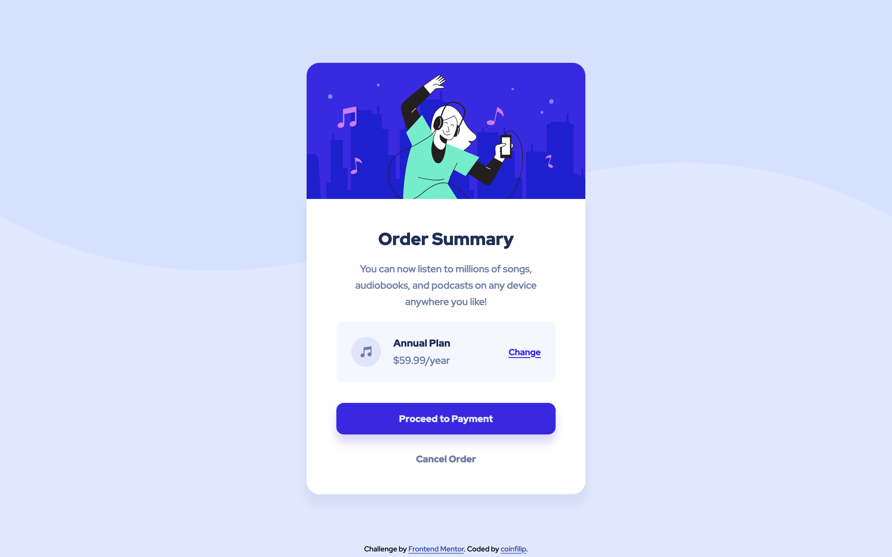

# Frontend Mentor - Order summary card solution

This is a solution to the [Order summary card challenge on Frontend Mentor](https://www.frontendmentor.io/challenges/order-summary-component-QlPmajDUj). Frontend Mentor challenges help you improve your coding skills by building realistic projects. 

## Table of contents

- [Overview](#overview)
  - [The challenge](#the-challenge)
  - [Screenshot](#screenshot)
  - [Links](#links)
- [My process](#my-process)
  - [Built with](#built-with)
  - [What I learned](#what-i-learned)
  - [Continued development](#continued-development)
  - [Useful resources](#useful-resources)
- [Author](#author)
- [Acknowledgments](#acknowledgments)

## Overview

### The challenge

Users should be able to:

- See hover states for interactive elements

### Screenshot



### Links

- Solution URL: [Github](https://github.com/coinfilip/frontend-mentor/tree/main/order-summary-component-main)
- Live Site URL: [Github Pages](https://coinfilip.github.io/frontend-mentor/order-summary-component-main/)

## My process

### Built with

- Semantic HTML5 markup
- CSS custom properties
- Flexbox

### What I learned

For this challenge, the challenge of replicating the box-shadow is one of the roadblocks I encountered, aside from getting the measurements for the height and widths of the containers.

```css
box-shadow: 0px 0.75rem 1em hsl(245deg 75% 52% / 20%);
```

Also, there are some layouts that can't be remedied by the mighty ```justify-content``` property of flexbox. That was proven for this challenge, as I was scratching my head wondering how to match the gaps between the items at **.card-details**. So went for the 'ol mighty ```margin-top``` for that.

### Continued development

Haven't fully realized the potential of DevTools from Google Chrome browser so I'll need to be more immersed in using it for the future projects/challenges. It's really handy for when I need to check the declarations made in real time if its really the same with the provided design.

Also, having less commits especially for style. I don't know if it's a bad habit, but for the recent challenges, I made small yet massive counts of commits for every progress I made on the CSS file. It has its advantages, but I fear that it may bring unneccessary clutter to the commit log so I tried to bring down the amount of commits for this challenge as much as possible. 

### Useful resources

- [box-shadow MDN reference](https://developer.mozilla.org/en-US/docs/Web/CSS/box-shadow#try_it) - One of the references I leaned on for checking on the properties of box-shadow. The **Try It** section is handy when you want to experiment on the CSS property.
- [box-shadow W3S reference](https://www.w3schools.com/cssref/css3_pr_box-shadow.php) - The other reference I also leaned on for inquiring about the syntax and values of box-shadow. If you're quite not used to seeing **x** and **y**, this one will use horizontal (h) and vertical (v) as guides.

## Author

- Website - [Github Profile](https://github.com/coinfilip)
- Frontend Mentor - [@coinfilip](https://www.frontendmentor.io/profile/coinfilip)

## Acknowledgments

- The Odin Project
- those behind the sites cited in Useful resources section 
- Frontend Mentor for the opportunity to take on this challenge