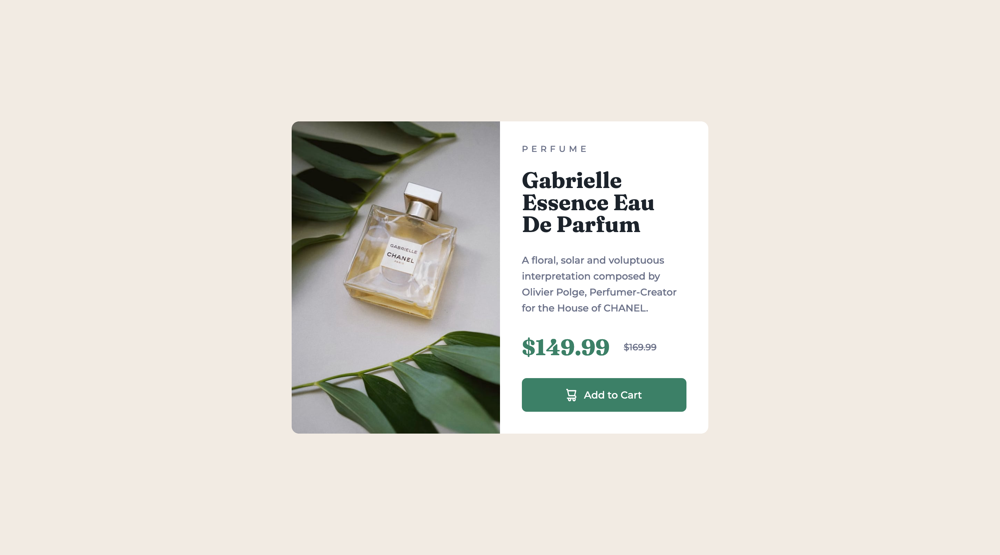

# Frontend Mentor - Product preview card component solution

This is a solution to the [Product preview card component challenge on Frontend Mentor](https://www.frontendmentor.io/challenges/product-preview-card-component-GO7UmttRfa). Frontend Mentor challenges help you improve your coding skills by building realistic projects. 

## Table of contents

- [Overview](#overview)
  - [The challenge](#the-challenge)
  - [Screenshot](#screenshot)
  - [Links](#links)
- [My process](#my-process)
  - [Built with](#built-with)
  - [What I learned](#what-i-learned)
  - [Continued development](#continued-development)
  - [Useful resources](#useful-resources)
- [Author](#author)
- [Acknowledgments](#acknowledgments)

## Overview

### The challenge

Users should be able to:

- View the optimal layout depending on their device's screen size
- See hover and focus states for interactive elements

### Screenshot



### Links

- Solution URL: [Github](https://github.com/coinfilip/frontend-mentor/tree/main/newbie/product-preview-card-component-main)
- Live Site URL: [Github Pages](https://coinfilip.github.io/frontend-mentor/newbie/product-preview-card-component-main/)

## My process

### Built with

- Semantic HTML5 markup
- CSS custom properties
- Flexbox

### What I learned

Oh, boy. I haven't realized this until I started doing the design for the desktop size. The roadblock of **an image beside text inside of a button**. Since I don't want to waste time scratching my head, I immediately consulted Google and this is the result of that consultation:

```html
<button class="btnAddCart">
  
  <span>Add to Cart</span>
</button>
```

You can check out the [Useful resources](#useful-resources) section for the journey and basis on that specific code block above.

Meanwhile, aside from setting a ```min-height``` property, I also started to include a ```height``` property on the **body** selector for this challenge. That's to cover the extra height if the viewport height of the browser exceeds the one specified in the ```min-height``` property so that the main container will still be vertically aligned at the center.

```css
body {
  min-height: 667px;
  height: 100vh;
}
```

### Continued development

Kind of getting used to the Chrome DevTools for measuring sizes on the desktop and mobile image designs. 

Although improving, still having a hard time on thinking about the steps I would take to guide myself on completing the challenges. Before, my way is to do things spontaneously, just trying things out, making mistakes, repeat trying and experimenting until I get to the final solution, but ends up having a stark difference from the desired look on the provided designs.

Quite happy now that I can at least replicate the size of the main container on the recent solutions. Getting ignorant on being pixel perfect when it comes to the fonts. Hoping I do better at the succeeding challenges as I face the fear of doing challenges with JavaScript sooner than I thought.

### Useful resources

- [Image button with HTML5](https://www.tutorialspoint.com/Image-button-with-HTML5) - First result cited by Google upon searching online on inserting an image inside a button beside the text. The page cites a few examples, so skip to **Example 4** for the specific example on adding an image inside a button element.
- [Align image and text in the middle of button element | Stackoverflow](https://stackoverflow.com/a/9421417) - Although the ```vertical-align``` property did not work in my end, I adopted using a span to wrap the text inside the button as I included an image beside it. Hope I did the right thing on that one.

## Author

- Website - [Github Profile](https://github.com/coinfilip)
- Frontend Mentor - [@coinfilip](https://www.frontendmentor.io/profile/coinfilip)

## Acknowledgments

- The Odin Project
- those behind the sites cited in Useful resources section 
- Frontend Mentor for the opportunity to take on this challenge