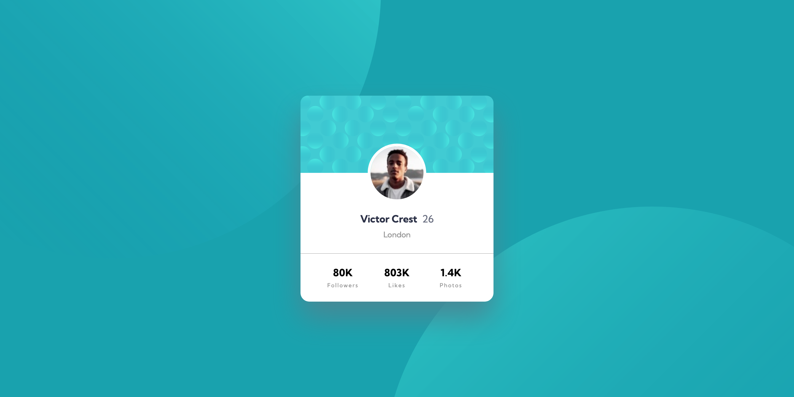

# Frontend Mentor - Profile card component solution

This is a solution to the [Profile card component challenge on Frontend Mentor](https://www.frontendmentor.io/challenges/profile-card-component-cfArpWshJ). Frontend Mentor challenges help you improve your coding skills by building realistic projects. 

## Table of contents

- [Overview](#overview)
  - [The challenge](#the-challenge)
  - [Screenshot](#screenshot)
  - [Links](#links)
- [My process](#my-process)
  - [Built with](#built-with)
  - [What I learned](#what-i-learned)
  - [Continued development](#continued-development)
  - [Useful resources](#useful-resources)
- [Author](#author)
- [Acknowledgments](#acknowledgments)

## Overview

### The challenge

- Build out the project to the designs provided

### Screenshot



### Links

- Solution URL: [Github](https://github.com/coinfilip/frontend-mentor/tree/main/newbie/profile-card-component-main)
- Live Site URL: [Github Pages](https://coinfilip.github.io/frontend-mentor/newbie/profile-card-component-main)

## My process

### Built with

- Semantic HTML5 markup
- CSS custom properties
- Flexbox

### What I learned

For this challenge, the unique roadblock I faced is using the two SVG files as part of the background. The following is a solution I came up with, yet not perfect if you count the responsiveness of the code on different screen widths.

```css
background: url(../images/bg-pattern-top.svg) no-repeat 125% 191%, url(../images/bg-pattern-bottom.svg) no-repeat -26% -92%;
```

Dissecting the code above, the background property uses 4 values pero image. 

1. **url()** - where we give the location of the image to use
2. **no-repeat** - in order to have the image not repeat itself when there is extra space
3. **125%** - background position in x-axis or horizontal axis
4. **191%** - background position in y-axis or vertical axis

Followed by a comma to separate the first image from the second one. Same structure is used on the second image.

### Continued development

This one's supposed to be easier from the previous one I finished (Huddle landing page) but I realized that each challenge here proposes unique roadblocks that even though I have prior experience with components before, I still get my head scratch on the succeeding ones. 

So, more practice to be better at head-scratching, I guess. Kidding. 

### Useful resources

- [background CSS reference | MDN](https://developer.mozilla.org/en-US/docs/Web/CSS/background) - A handy reference to check what I can do with the background property on including the two SVG files and setting their positions as indicated on the designs.

## Author

- Website - [Github Profile](https://github.com/coinfilip)
- Frontend Mentor - [@coinfilip](https://www.frontendmentor.io/profile/coinfilip)

## Acknowledgments

- The Odin Project
- those behind the sites cited in Useful resources section 
- Frontend Mentor for the opportunity to take on this challenge