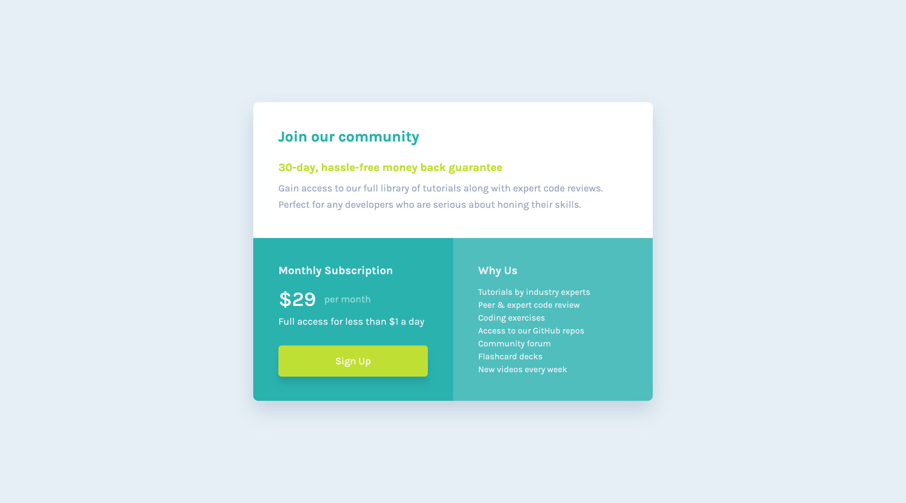

# Frontend Mentor - Single price grid component solution

This is a solution to the [Single price grid component challenge on Frontend Mentor](https://www.frontendmentor.io/challenges/single-price-grid-component-5ce41129d0ff452fec5abbbc). Frontend Mentor challenges help you improve your coding skills by building realistic projects. 

## Table of contents

- [Overview](#overview)
  - [The challenge](#the-challenge)
  - [Screenshot](#screenshot)
  - [Links](#links)
- [My process](#my-process)
  - [Built with](#built-with)
  - [What I learned](#what-i-learned)
  - [Continued development](#continued-development)
  - [Useful resources](#useful-resources)
- [Author](#author)
- [Acknowledgments](#acknowledgments)

## Overview

### The challenge

Users should be able to:

- View the optimal layout for the component depending on their device's screen size
- See a hover state on desktop for the Sign Up call-to-action

### Screenshot



### Links

- Solution URL: [Github](https://github.com/coinfilip/frontend-mentor/tree/main/newbie/single-price-grid-component-master)
- Live Site URL: [Github Pages](https://coinfilip.github.io/frontend-mentor/newbie/single-price-grid-component-master)

## My process

### Built with

- Semantic HTML5 markup
- CSS custom properties
- Flexbox
- CSS Grid

### What I learned

I noticed two things that I learned while doing this challenge. 

First is using Grid. My knowledge on the matter is kind of rusty at the point of starting this challenge, so spent some time watching and reading refreshers to be oriented on using the CSS layout. 

Came up with these lines, below is for the desktop size.

```css
grid-template-columns: repeat(2, 1fr);
grid-template-rows: 45.47% 54.53%;
```

And this one on the other hand, is for mobile. 

```css
grid-template-columns: 1fr;
grid-template-rows: 267px 228px 227px;
```

Another one is the extra margin space on mobile design that I haven't noticed until I scroll back down to work on the last section. It was fixed by using the ```margin-bottom``` property on main element.

### Continued development

This is my first time in a while on using Grid, so would like to have this included on the succeeding challenges to be confident (slowly or not) on using it.

### Useful resources

- [A Complete Guide to CSS Grid | CSS Tricks](https://css-tricks.com/snippets/css/complete-guide-grid/) - A great resource to quickly browse the properties of grid.
- [Grids | MDN](https://developer.mozilla.org/en-US/docs/Learn/CSS/CSS_layout/Grids#creating_your_grid_in_css) - If you're tired or can't comprehend a lot of words from the previous resource, you can watch the video on this page from Mozilla Developer Network.

## Author

- Website - [Github Profile](https://github.com/coinfilip)
- Frontend Mentor - [@coinfilip](https://www.frontendmentor.io/profile/coinfilip)

## Acknowledgments

- The Odin Project
- those behind the sites cited in Useful resources section 
- Frontend Mentor for the opportunity to take on this challenge