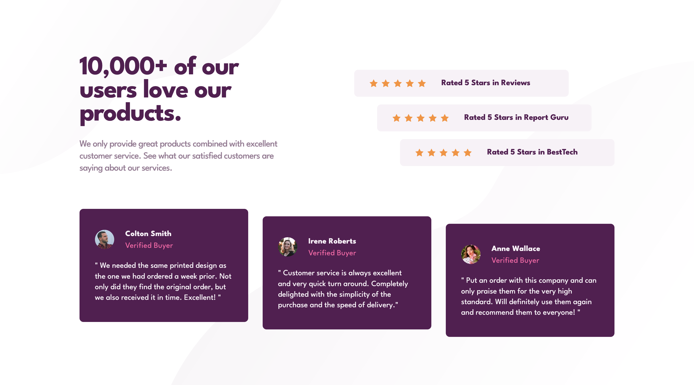

# Frontend Mentor - Social proof section solution

This is a solution to the [Social proof section challenge on Frontend Mentor](https://www.frontendmentor.io/challenges/social-proof-section-6e0qTv_bA). Frontend Mentor challenges help you improve your coding skills by building realistic projects. 

## Table of contents

- [Overview](#overview)
  - [The challenge](#the-challenge)
  - [Screenshot](#screenshot)
  - [Links](#links)
- [My process](#my-process)
  - [Built with](#built-with)
  - [What I learned](#what-i-learned)
  - [Continued development](#continued-development)
  - [Useful resources](#useful-resources)
- [Author](#author)
- [Acknowledgments](#acknowledgments)

## Overview

### The challenge

Users should be able to:

- View the optimal layout for the section depending on their device's screen size

### Screenshot



### Links

- Solution URL: [Github](https://github.com/coinfilip/frontend-mentor/tree/main/newbie/social-proof-section-master)
- Live Site URL: [Github Pages](https://coinfilip.github.io/frontend-mentor/newbie/social-proof-section-master)

## My process

### Built with

- Semantic HTML5 markup
- CSS custom properties
- Flexbox
- CSS Grid
- Mobile-first workflow

### What I learned

As mentioned in the previous section, I used **mobile-first workflow** on my approach to styling the HTML document. Kind of nauseating as I'm used to doing the desktop design first before the mobile ones. But due to the difficulty of thinking about the approaches for some of the designs in the desktop one, I decided to do the mobile one first. 

Also, there are two more things I want to highlight here:

First, on how to align the containers for rates (the ones with the 5-stars) and reviews. 

I first set the width of the section/main container for the three items, then set the width of the individual items next. 

And here comes the aligning part. Aligned the middle one first by using ```margin: 0 auto;```. Then for the top and bottom item, I overwrite the previous margin rules by using the following rules:

```css
 article.rateItem:first-child {
    margin-left: 0;
}

article.rateItem:last-child {
    margin-right: 0;
}
```

Secondly, the problem of the 5-stars. Had to use the one that uses more redundant lines. 

One option I used is using ```background``` property with the repeat value of ```space``` for x-axis. 

```css
div.rateItemStars {
    background: url(../images/icon-star.svg) space no-repeat center;
    height: 18px;
    width: 100px;
}
```

The benefit of using ```space``` as background-repeat value is that it will automatically set apart items as long as there is extra space. Bad thing about it is the space is less than the width of the image as any more extra will insert another instance of the image inside the container. That's why I set the width to 100px, as any extra pixels beyond that will add another star (or image) inside the container which I do not intend, as I need to match the design file.

So the approach I used for the final style rules is adding 5 divs inside the ```.rateItemStars``` container and using flex to have gaps between those 5 items. 

```css
div.rateItemStars {
    height: 17px;
    display: flex;
    gap: 8px;
}

div.rateItemStarPiece {
    background: url(../images/icon-star.svg) no-repeat center;
    width: 17px;
    height: auto;
}
```

### Continued development

Not quite fulfilled with my goal of using less (redundant) code as possible but I guess that's the compromise I need to do to get close to the design. Will strive to learn more properties in CSS & HTML to be more informed and have more diverse options to choose. 

Also, what I did in the .rates section might be unpleasant in terms of accessibility. That's one of the things I'll strive to align to for future challenges

### Useful resources

Although not used in the final style rules, these articles helped me discover the value of ```space``` for background-repeat:

- [Background Repeat and its Possibilities](https://chipcullen.com/background-repeat-and-its-possibilities/) 
- [background-repeat | MDN reference ](https://developer.mozilla.org/en-US/docs/Web/CSS/background-repeat)
- [background-repeat | W3Schools reference](https://www.w3schools.com/cssref/pr_background-repeat.php)

I also adopted the use of ```section``` and ```article``` in the HTML structure thanks to this resource:
- [HTML Semantic Elements | W3Schools reference](https://www.w3schools.com/html/html5_semantic_elements.asp)

## Author

- Website - [Github Profile](https://github.com/coinfilip)
- Frontend Mentor - [@coinfilip](https://www.frontendmentor.io/profile/coinfilip)

## Acknowledgments

- The Odin Project
- those behind the sites cited in Useful resources section 
- Frontend Mentor for the opportunity to take on this challenge, and the people that I interacted with through this platform