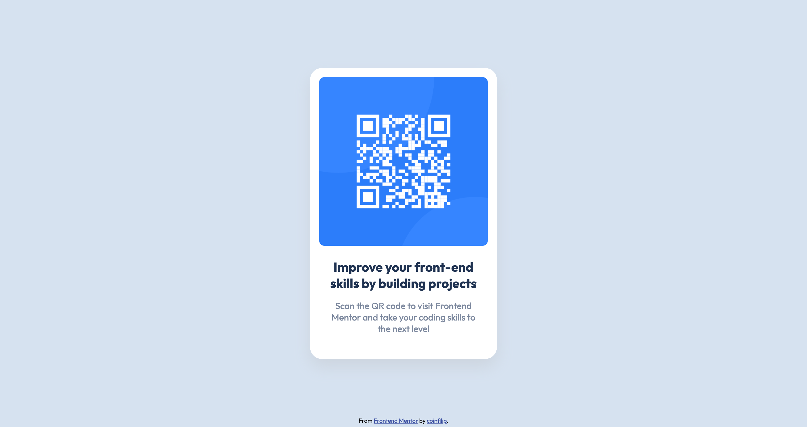

# Frontend Mentor - QR code component solution

This is a solution to the [QR code component challenge on Frontend Mentor](https://www.frontendmentor.io/challenges/qr-code-component-iux_sIO_H). Frontend Mentor challenges help you improve your coding skills by building realistic projects. 

## Table of contents

- [Overview](#overview)
  - [Screenshot](#screenshot)
  - [Links](#links)
- [My process](#my-process)
  - [Built with](#built-with)
  - [What I learned](#what-i-learned)
  - [Continued development](#continued-development)
  - [Useful resources](#useful-resources)
- [Author](#author)
- [Acknowledgments](#acknowledgments)

## Overview

### Screenshot



### Links

- Solution URL: [Github](https://github.com/coinfilip/frontend-mentor/tree/main/qr-code-component-main)
- Live Site URL: [Github Pages](https://coinfilip.github.io/frontend-mentor/qr-code-component-main/)

## My process

### Built with

- Semantic HTML5 markup
- CSS custom properties
- Flexbox

### What I learned

Learned to use the ruler from the browser's DevTools. It was very handy to me that's struggling to check about the dimensions (height and width) I need to use for the component as I start from zero.

Relearned something about setting the attribution to the bottom of the page and that's by using the 'fixed' value for the position attribute on the footer selector. Since it doesn't follow the normal flow of the page, I believe it is handy to not affect the other elements in the body. 

Positioning the component in the center horizontally and vertically is the hardest part for me. Actually, horizontal center is quite easy which leaves us with the vertical center that gave me headaches as to what I should do. Luckily, with a Google search, I got the answer, using Flexbox.

```css
body {
    margin: 0;
    min-height: 100vh;
    display: flex;
    align-items: center;
    justify-content: center;
}
```

Setting the display attribute of the body to 'flex' and setting the align-items and justify-content attribute to 'center' solved the problem for me.

Setting the margin also to 0 to avoid having to deal with problems about extra space despite setting the height to just the entirety of the screen height. 

### Continued development

Not quite used to flexbox (as I forgot the basics and relearning them again) so I'll hone my skills on that category in my future challenges.

### Useful resources

- [Vertically align a container using Flexbox](https://stackoverflow.com/a/52867648) - This helped me do exactly that since I only managed to center align elements horizontally. 
- [The Surprising Truth About Pixels and Accessibility](https://www.joshwcomeau.com/css/surprising-truth-about-pixels-and-accessibility/) - An article shared to me by Melvin got me immersed in another perspective for accessibility. This got me avoiding the use of pixels at least in font sizes in my future exercises (I'll try).

## Author

- Website - [Github  Profile](https://github.com/coinfilip)
- Frontend Mentor - [@coinfilip](https://www.frontendmentor.io/profile/coinfilip)

## Acknowledgments

I would like to thank [Melvin Aguilar](https://www.frontendmentor.io/profile/MelvinAguilar) for giving feedback to the early version of the solution. The advises provided in his comment helped shape the current code of the solution you're now seeing. 